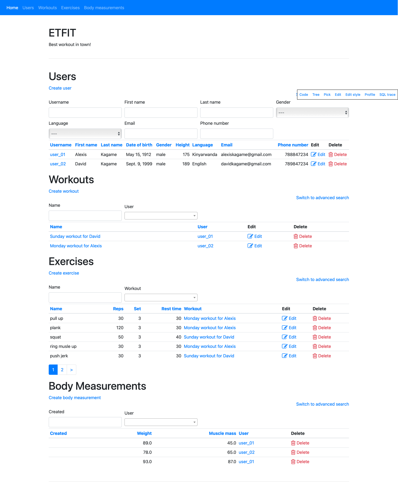
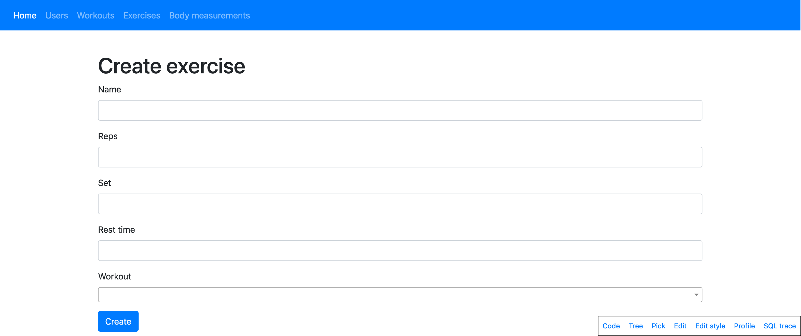
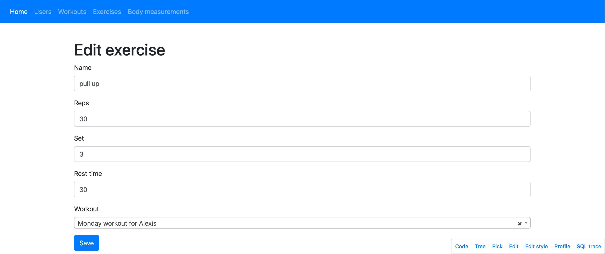
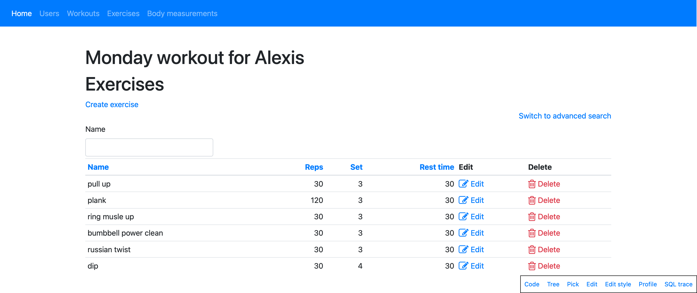
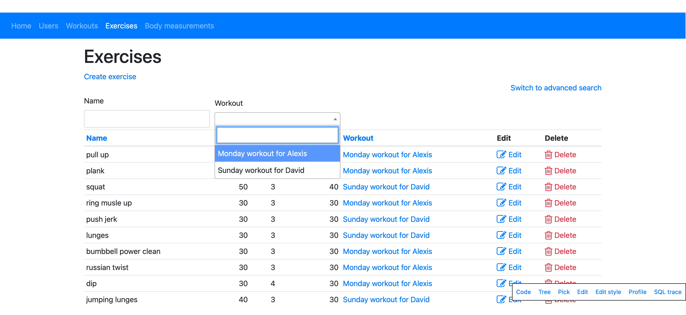

# About
- [About](#about)
  - [Technologies](#technologies)
  - [Features](#features)
  - [Features (next up)](#features-next-up)
  - [Screenshots](#screenshots)
  

ETFIT is a Python & Django MVC application that allows users to track training workouts. Users can add exercises and create routines on the fly, logging their activity.

## Technologies

- Python
- Django
- Iommi

## Features

- Search box capable of searching these fields:
  - user: `username`, `first_name`, `last_name`, `gender`, `language`, `email`, `phone_number`
  - workout: `name`, `user`
  - exercise: `name`, `workout`
  - body measurement: `user`

- Add a new user
- Add workout to an user
- Edit an user
- Delete an user
- View user
- Add a new workout
- Add exercises to a workout
- Edit a workout
- Delete a workout
- View workout
- Add a new exercise
- Edit a exercise
- Delete a exercise
- Add a body measurement
- Delete a body measurement
- View body measurement

## Features (next up)

- Register new users
- Login existing users
- Body measurement graphs
- Workout statistics
- Advanced search

## Screenshots

*1. Homepage*

*2. Add Exercise*

*3. Edit Exercise*

*4. View Workout*

*5. View Exercisess*
